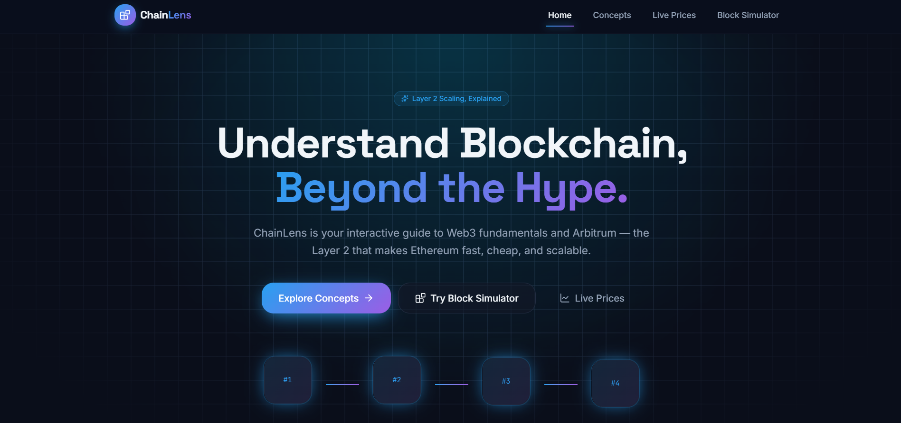
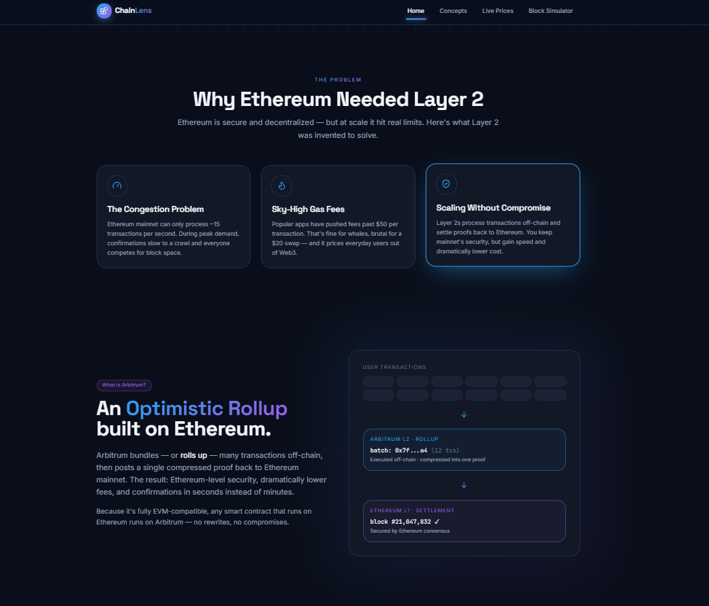
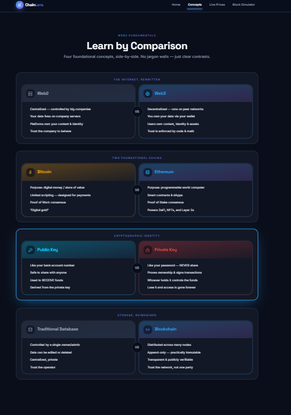
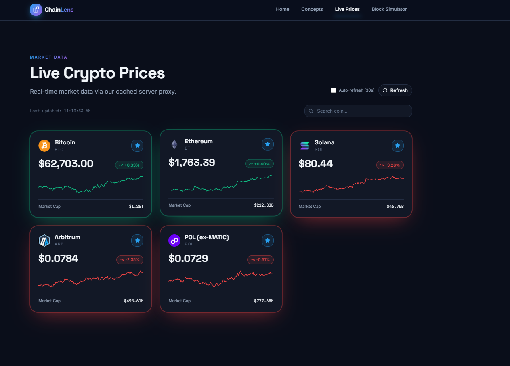
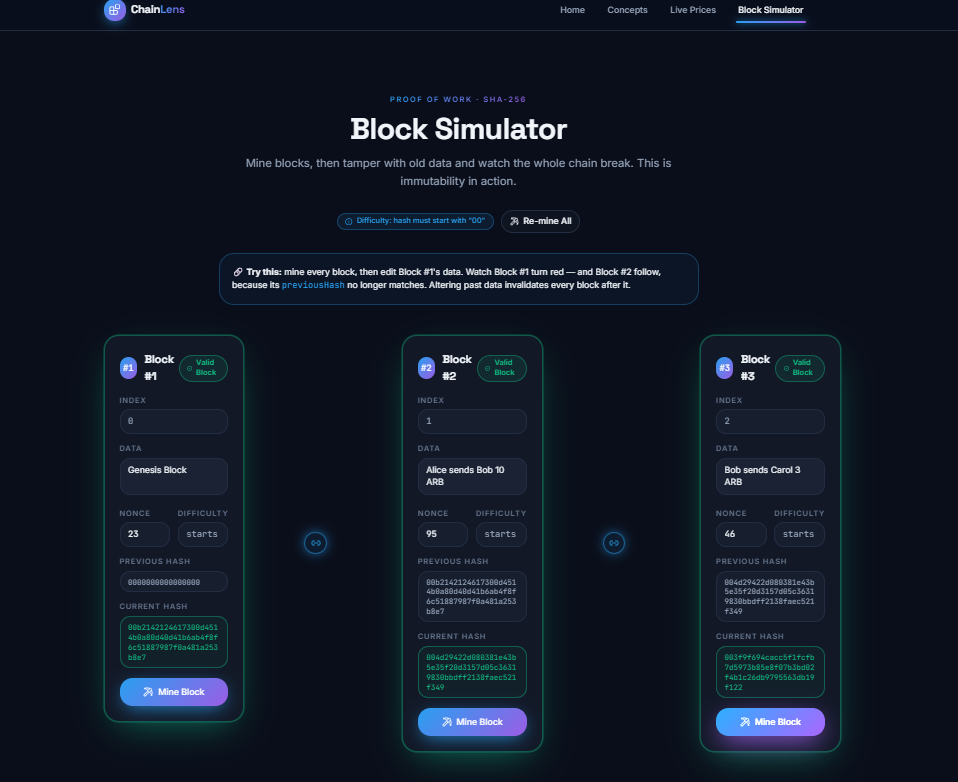
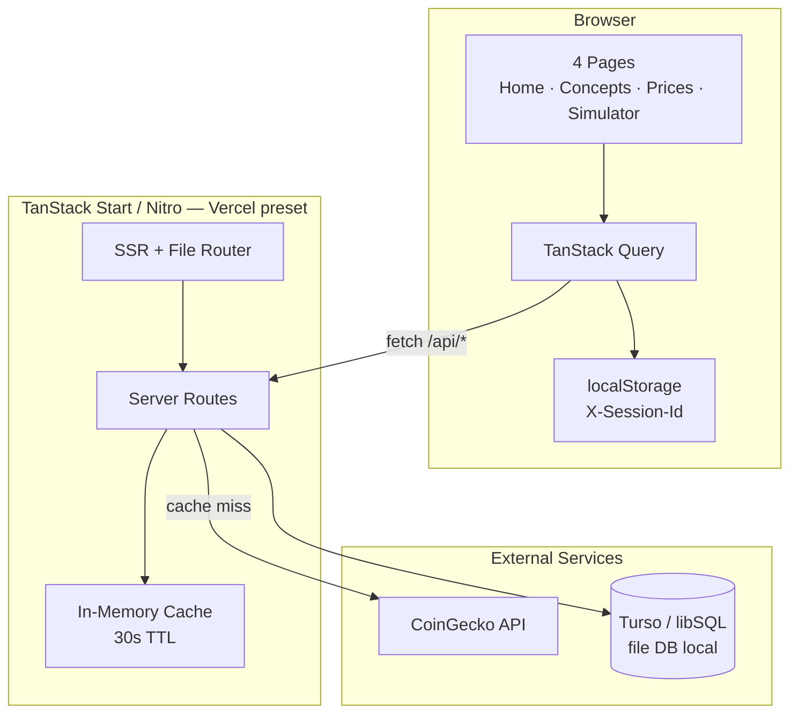
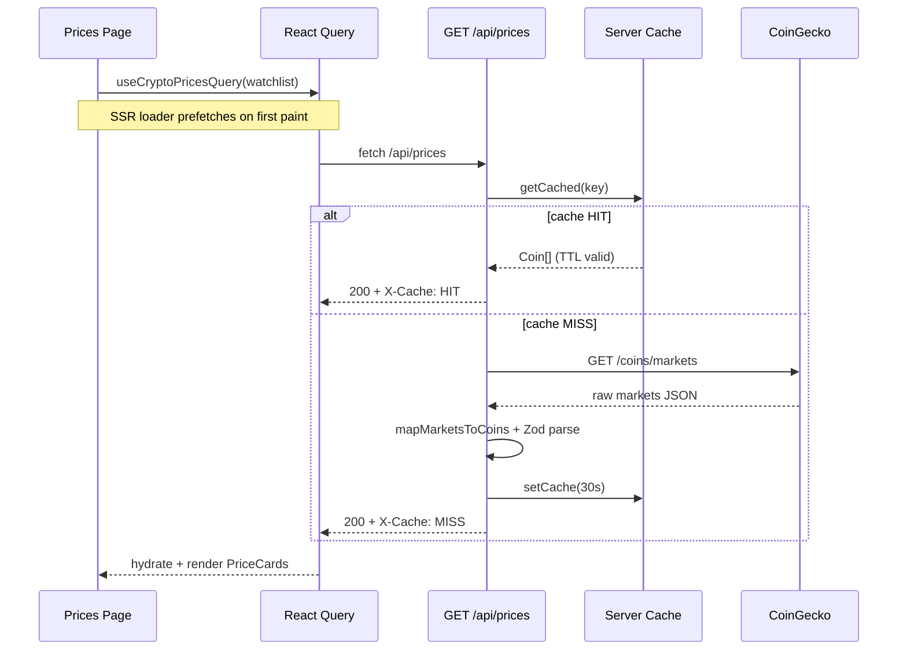

<div align="center">

# ChainLens

### Understand Blockchain, Beyond the Hype.

An interactive, full-stack Web3 learning platform — explore Arbitrum Layer 2 concepts, track live crypto prices, and mine a real proof-of-work blockchain in your browser.

<br />

<!-- Stack badges — static shields.io URLs -->


<br />


<br />


<br /><br />

<!-- Status badges -->


<br /><br />



<sub><em>Home — hero section with links to Concepts, Block Simulator, and Live Prices</em></sub>

<br /><br />

[🚀 Live Demo](#) · [📖 Documentation](#table-of-contents) · [🐛 Report Bug](https://github.com/Neel-2606/Arbitrum-Builder-Lab-Workshop/issues) · [✨ Request Feature](https://github.com/Neel-2606/Arbitrum-Builder-Lab-Workshop/issues)

> **TODO:** Replace Live Demo `#` with your deployed Vercel URL once live.

<br />

**ChainLens turns Web3 theory into something you can click, mine, and break — backed by a real TanStack Start server, cached price API, and Turso persistence.**

</div>

---

## Table of Contents

- [Overview — The Story](#overview--the-story)
- [Highlights](#highlights--why-this-project-stands-out)
- [Feature Deep Dive](#feature-deep-dive)
  - [Frontend Experience](#5a-frontend-experience)
  - [Backend & Data](#5b-backend--data)
  - [Engineering Quality](#5c-engineering-quality)
- [The Four Pages](#the-four-pages)
  - [6.1 Home / Landing](#61-home--landing)
  - [6.2 Concepts](#62-concepts)
  - [6.3 Live Prices](#63-live-prices)
  - [6.4 Block Simulator](#64-block-simulator)
- [Architecture](#architecture)
- [Tech Stack](#tech-stack-detailed)
- [Project Structure](#project-structure)
- [API Reference](#api-reference)
- [Getting Started](#getting-started)
- [Environment Variables](#environment-variables)
- [Scripts & Tooling](#scripts--tooling)
- [Testing](#testing)
- [Deployment (Vercel + Turso)](#deployment-vercel--turso)
- [Design Decisions & Trade-offs](#design-decisions--trade-offs)
- [Challenges & What I Learned](#challenges--what-i-learned)
- [Roadmap](#roadmap--future-improvements)
- [Contributing](#contributing)
- [Acknowledgements](#acknowledgements)
- [Author & Contact](#author--contact)

---

## Overview — The Story

**ChainLens** is an interactive Web3 and **Arbitrum Layer 2** learning platform. Instead of static documentation, it teaches blockchain fundamentals through four hands-on experiences: a narrative landing page, side-by-side concept comparisons, a live crypto price dashboard, and a proof-of-work block simulator where you can literally break an immutable chain by editing past data.

The project began as an **Arbitrum Builder Pods** assignment: ship a polished four-page Web3 site with responsive design, active navigation, and a design system that feels production-grade. The required frontend — Home, Concepts, Live Prices, and Block Simulator — was the foundation.

I then upgraded it into a **genuine full-stack application**:

- **TanStack Start server routes** (`/api/prices`, `/api/health`, `/api/chains`, `/api/watchlist`) colocated with file-based routing in a single Nitro deployable unit
- A **cached CoinGecko proxy** (30s in-memory TTL) replacing the original client-side `api.ts` TODO
- **Drizzle ORM** over **Turso/libSQL** with a local file-DB fallback for zero-config dev
- **TanStack Query** with SSR prefetch on the Prices route, optimistic watchlist updates, and persisted saved chains
- **Vitest** unit tests on hashing, price normalization, and cache TTL
- A colorized **`skills.sh`** CLI wrapping the entire developer lifecycle

The philosophy is simple: **learn by doing**. Every concept is clickable, minable, or comparable — not a wall of text.

**Who is this for?** Web3-curious developers, students reviewing blockchain fundamentals, and engineers evaluating a portfolio piece that demonstrates full-stack TypeScript craft.

---

## Highlights — Why This Project Stands Out

- **Real SHA-256 proof-of-work** in the browser — mine blocks until `hash.startsWith("00")`, with `js-sha256` fallback when `crypto.subtle` is unavailable (non-secure origins)
- **Live tamper detection** — edit Block #1's data and watch invalidity cascade down the chain via `previousHash` linkage
- **Cached server-side price proxy** — `/api/prices` shields clients from CoinGecko rate limits with a 30s TTL and normalized `Coin[]` shape
- **Persisted saved chains** — save, load, and delete mined blockchains via `/api/chains` (Drizzle + Turso)
- **Star-to-watchlist** with optimistic UI updates and DB persistence via `/api/watchlist`
- **SSR + hydration-safe prefetch** on `/prices` using TanStack Router loaders + React Query
- **Strict TypeScript** across routes, hooks, server modules, and shared types
- **Zod-validated API contracts** with a consistent `{ error: { message, code } }` envelope
- **Focused unit tests** — 8 tests across hash logic, price mapper, and cache TTL (Vitest)
- **One-command dev workflow** — `./skills.sh` wraps setup, dev, lint, typecheck, build, test, and database tasks
- **Accessible UI** — focus rings, `aria-label`s, `prefers-reduced-motion`, screen-reader mining status
- **Vercel-ready** — Nitro `vercel` preset with `entryFormat: "node"` workaround for prerender compatibility

---

## Feature Deep Dive

### 5a. Frontend Experience

| Capability | Implementation |
| --- | --- |
| **SSR + routing** | TanStack Start file-based routes in `src/routes/`; shell in `__root.tsx` with Navbar + Footer |
| **Responsive design** | Tailwind v4 design tokens (`bg-base`, `text-ink`, `text-gradient`, etc.); mobile nav drawer; simulator stacks blocks until `lg` breakpoint |
| **Active nav** | TanStack Router `activeProps` / `inactiveProps` on desktop and mobile links |
| **Loading states** | `SkeletonCard` on Prices; React Query `isLoading` / `isFetching` with spinner on refresh |
| **Motion** | Framer Motion on hero, cards, nav underline — gated by `useReducedMotion` + global CSS `prefers-reduced-motion` |
| **Accessibility** | Coin logo `alt` text; star button `aria-label`s; mining `aria-busy`; search `aria-label`; error `role="alert"` |

### 5b. Backend & Data

| Capability | Implementation |
| --- | --- |
| **`GET /api/prices`** | Server-side CoinGecko fetch → Zod-validated `Coin[]`; 30s in-memory cache; `Cache-Control: public, max-age=30`; optional `?ids=` query param |
| **`GET /api/health`** | `{ status, uptime, version }` from `APP_VERSION` env |
| **`/api/chains`** | `GET` list, `POST` save, `GET /:id` load, `DELETE /:id` remove — requires `X-Session-Id` header |
| **`/api/watchlist`** | `GET` / `POST` / `DELETE /:coinId` — persisted coin IDs per anonymous session |
| **Validation** | Zod schemas in `src/server/schemas.ts` |
| **Error contract** | `{ error: { message, code } }` via `src/server/api-error.ts` |
| **Database** | Drizzle ORM + `@libsql/client`; Turso when `TURSO_*` env vars set; else `file:./data/chainlens.db` |

### 5c. Engineering Quality

| Capability | Implementation |
| --- | --- |
| **Strict TypeScript** | `tsconfig.json` strict mode; `bunx tsc --noEmit` in `./skills.sh typecheck` |
| **Unit tests** | Vitest 4 — `hash.test.ts`, `coingecko.test.ts`, `cache.test.ts` |
| **Lint / format** | ESLint 9 + Prettier 3 |
| **CI gate** | `./skills.sh check` → lint → typecheck → build |
| **Env-driven config** | `.env.example`; no hardcoded secrets; CoinGecko URL overridable |
| **Dev CLI** | `skills.sh` — Bun-aware, colorized, `set -euo pipefail` |

---

## The Four Pages

### 6.1 Home / Landing

**What it does:** Introduces ChainLens with a hero, explains why Ethereum needed Layer 2 (`WhyLayer2`), what Arbitrum is as an optimistic rollup (`WhatIsArbitrum`), four feature cards (`Features`), and a real-world cost/latency comparison (`RealWorldBenefit`). CTAs route to Concepts, Simulator, and Live Prices.

**Under the hood:** Composed from `src/components/home/*` sections; route meta in `src/routes/index.tsx`; author and SEO constants in `src/constants/site.ts`.

**What it demonstrates:** Narrative technical writing + polished marketing layout without sacrificing engineering substance.

<table>
  <tr>
    <td width="50%" align="center">
      
      <br /><sub><em>Hero — tagline, CTAs, animated block chain decoration</em></sub>
    </td>
    <td width="50%" align="center">
      
      <br /><sub><em>Features — Why Layer 2, Arbitrum rollup diagram, real-world benefit</em></sub>
    </td>
  </tr>
</table>

---

### 6.2 Concepts

**What it does:** Four comparison cards teach foundational Web3 ideas side-by-side:

1. **Web2 vs Web3** — centralized platforms vs decentralized networks
2. **Bitcoin vs Ethereum** — store of value vs programmable world computer
3. **Public Key vs Private Key** — receive vs sign; share vs never share
4. **Blockchain vs Traditional Database** — append-only distributed ledger vs editable centralized store

**Under the hood:** Data-driven from `src/data/concepts.ts` using the typed `Concept` / `ConceptSide` shapes in `src/types/index.ts`. Rendered by `ComparisonCard` with tone-based gradient headers and Lucide icons.

**What it demonstrates:** Content-as-data separation, typed domain models, and scannable UX for complex topics.

<p align="center">
  
  <br /><sub><em>Concepts — four comparison cards with VS divider and tone-coded headers</em></sub>
</p>

---

### 6.3 Live Prices

**What it does:** Displays live market data for **Bitcoin, Ethereum, Solana, Arbitrum, and Polygon** (CoinGecko ID: `polygon-ecosystem-token`). Each card shows price, 24h change (green/red), 7-day sparkline, and market cap. Features search (debounced via `useDeferredValue`), manual refresh, optional 30s auto-refresh, and star-to-watchlist with optimistic updates.

**Under the hood:** Client calls `/api/prices` through `src/services/api.ts`. TanStack Query hooks in `src/hooks/usePricesQuery.ts` (`useCryptoPricesQuery`, `useWatchlistQuery`, `useWatchlistMutations`). Route loader in `src/routes/prices.tsx` prefetches prices + watchlist during SSR. Watchlist persisted via `/api/watchlist` with anonymous `X-Session-Id` from `localStorage`.

**What it demonstrates:** Server proxy pattern, React Query SSR hydration, optimistic mutations, and real-time market UX.

<p align="center">
  
  <br /><sub><em>Live Prices — cached CoinGecko proxy, sparklines, search, watchlist stars</em></sub>
</p>

---

### 6.4 Block Simulator

**What it does:** The crown jewel. A three-block proof-of-work chain where each block's hash is:

```
sha256(index + data + previousHash + nonce)
```

Mining increments `nonce` until the hash meets the **`"00"` difficulty prefix** (`DIFFICULTY_PREFIX` in `src/utils/hash.ts`) — interactive in the browser, versus Bitcoin's ~19 leading zeros. Blocks link via `previousHash`. Edit an earlier block's `data` and downstream blocks turn **invalid** — immutability made tangible.

**Saved chains:** Name and persist your mined chain via the Saved Chains panel (`POST /api/chains`), load it back, or delete it.

**Under the hood:** `src/hooks/useChain.ts` manages chain state, async hash recomputation (with mining-loop guard to prevent render storms), and mining with a 5,000,000-iteration safety cap. Hashing uses Web Crypto on secure contexts (`localhost` / HTTPS) with `js-sha256` fallback.

**What it demonstrates:** Proof-of-work, chain linkage, immutability, async UI safety, and full-stack persistence.

<p align="center">
  
  <br /><sub><em>Block Simulator — mine, tamper, watch the chain break, save to database</em></sub>
</p>

**Mining loop** (derived from `useChain.ts`):

```typescript
while (nonce <= MAX_MINING_ITERATIONS) {
  hash = await sha256(buildHashInput(index, data, previousHash, nonce));
  if (hash.startsWith("00")) break; // isValidHash(hash)
  nonce++;
  if (nonce % 500 === 0) await yieldToMainThread(); // keep UI responsive
}
```

---

## Architecture

### System diagram



### Price request sequence



### Request lifecycle

The `/api/prices` proxy exists because calling CoinGecko directly from the browser caused **HTTP 429 rate limits** and exposed an inconsistent response shape. The server route normalizes markets data into a single `Coin[]` type, caches responses for 30 seconds per cache key, and sets `Cache-Control` headers so downstream clients behave predictably. The original client-side TODO in `src/services/api.ts` is fulfilled — the browser now calls `/api/prices` only.

### Data model

**`saved_chains`** (`src/db/schema.ts`)

| Column | Type | Description |
| --- | --- | --- |
| `id` | `TEXT PK` | UUID primary key |
| `session_id` | `TEXT` | Anonymous session from `X-Session-Id` |
| `name` | `TEXT` | User-provided chain name |
| `blocks_json` | `TEXT` | Serialized `Block[]` |
| `difficulty` | `TEXT` | Optional difficulty prefix (e.g. `"00"`) |
| `created_at` | `INTEGER` | Unix ms timestamp |
| `updated_at` | `INTEGER` | Unix ms timestamp |

**`watchlist`**

| Column | Type | Description |
| --- | --- | --- |
| `id` | `TEXT PK` | UUID primary key |
| `session_id` | `TEXT` | Anonymous session |
| `coin_id` | `TEXT` | CoinGecko coin ID (e.g. `bitcoin`) |
| `added_at` | `INTEGER` | Unix ms timestamp |

Unique index: `(session_id, coin_id)` — `watchlist_session_coin_idx`

Migration file: `drizzle/0000_init.sql`

---

## Tech Stack (detailed)

| Layer | Technology | Version | Why chosen |
| --- | --- | --- | --- |
| **Framework** | TanStack Start | ^1.168.26 | Full-stack SSR + colocated server routes in one deployable unit |
| **Router** | TanStack Router | ^1.170.16 | File-based routing, loaders, `activeProps`, typed navigation |
| **Data fetching** | TanStack Query | ^5.101.1 | SSR prefetch, staleTime, optimistic watchlist mutations |
| **UI** | React | ^19.2.0 | Concurrent features, modern component model |
| **Styling** | Tailwind CSS | ^4.2.1 | Config-less v4 via `@tailwindcss/vite`; custom design tokens |
| **Animation** | Framer Motion | ^12.42.2 | Hero and card entrance animations with reduced-motion support |
| **Icons** | Lucide React | ^0.575.0 | Consistent icon set across pages |
| **ORM** | Drizzle ORM | ^0.45.2 | Type-safe SQLite schema; Turso-compatible |
| **Database** | @libsql/client | ^0.17.4 | Turso in production; `file:` URL locally — no native build on Windows |
| **Validation** | Zod | ^3.24.2 | API request/response schemas |
| **Hashing fallback** | js-sha256 | ^0.11.1 | SHA-256 when `crypto.subtle` unavailable on LAN HTTP |
| **Build** | Vite | ^8.0.16 | Fast dev + production bundling |
| **Server bundle** | Nitro | 3.0.260603-beta | Vercel serverless preset; outputs `.vercel/output/` |
| **Config wrapper** | @lovable.dev/vite-tanstack-config | ^2.6.4 | Pre-configured TanStack Start + Nitro + Tailwind (do not duplicate plugins) |
| **Testing** | Vitest | ^4.1.9 | Fast unit tests for pure logic |
| **Linting** | ESLint + Prettier | ^9.32 / ^3.7 | Code quality gate |
| **Runtime / PM** | Bun | ≥ 1.0 | Install, dev, build, test — single fast toolchain |
| **Deploy** | Vercel | — | TanStack Start framework preset; Bun 1.x via `vercel.json` |

---

## Project Structure

<details>
<summary><strong>Click to expand full project tree</strong></summary>

```
chainlens-academy/
├── public/                      # Static assets (screenshots for README)
│   ├── home-1.png
│   ├── home-2.png
│   ├── concepts.png
│   ├── prices.png
│   └── simulator.png
├── drizzle/
│   └── 0000_init.sql            # Initial migration (saved_chains + watchlist)
├── src/
│   ├── routes/                  # TanStack Start file-based routes
│   │   ├── __root.tsx           # App shell — Navbar, Footer, QueryClient, error/404
│   │   ├── index.tsx            # / — Home
│   │   ├── concepts.tsx         # /concepts
│   │   ├── prices.tsx           # /prices — SSR prefetch loader
│   │   ├── simulator.tsx        # /simulator
│   │   └── api/                 # Server-only routes
│   │       ├── prices.ts        # GET /api/prices (cached proxy)
│   │       ├── health.ts        # GET /api/health
│   │       ├── chains.ts        # GET/POST /api/chains
│   │       ├── chains/$id.ts    # GET/DELETE /api/chains/:id
│   │       ├── watchlist.ts     # GET/POST /api/watchlist
│   │       └── watchlist/$coinId.ts
│   ├── components/
│   │   ├── home/                # Hero, WhyLayer2, WhatIsArbitrum, Features, RealWorldBenefit
│   │   ├── concepts/            # ComparisonCard
│   │   ├── prices/              # PriceCard, Sparkline, SkeletonCard
│   │   ├── simulator/           # Block, ChainConnector, HowItWorks, SavedChainsPanel
│   │   ├── layout/              # Navbar, Footer
│   │   ├── uikit/               # Custom design system (Button, Card, Badge, …)
│   │   └── ui/                  # shadcn/ui primitives
│   ├── hooks/
│   │   ├── useChain.ts          # Block simulator state + mining loop
│   │   ├── usePricesQuery.ts    # React Query — prices + watchlist
│   │   └── useChainsQuery.ts    # React Query — saved chains CRUD
│   ├── services/
│   │   ├── api.ts               # Client → /api/prices
│   │   ├── chains.ts            # Client → /api/chains
│   │   └── watchlist.ts         # Client → /api/watchlist
│   ├── server/                  # Server-only modules
│   │   ├── coingecko.ts         # CoinGecko fetch + mapMarketsToCoins
│   │   ├── cache.ts             # In-memory TTL cache
│   │   ├── api-error.ts         # Standard error envelope
│   │   ├── schemas.ts           # Zod schemas
│   │   ├── session.ts           # X-Session-Id header parsing
│   │   └── repositories.ts      # Drizzle CRUD for chains + watchlist
│   ├── db/
│   │   ├── schema.ts            # Drizzle table definitions
│   │   ├── index.ts             # libSQL client (Turso or file fallback)
│   │   └── seed.ts              # Default watchlist seed
│   ├── utils/
│   │   ├── hash.ts              # SHA-256, difficulty, buildHashInput
│   │   └── format.ts            # USD / percent / time formatters
│   ├── data/
│   │   └── concepts.ts          # Four comparison card definitions
│   ├── constants/
│   │   ├── coins.ts             # TRACKED_COIN_IDS
│   │   └── site.ts              # Author, version, program metadata
│   ├── types/
│   │   └── index.ts             # Coin, Concept, Block interfaces
│   ├── server.ts                # SSR error wrapper entry
│   ├── start.ts                 # TanStack Start middleware
│   └── styles.css               # Tailwind v4 tokens + utilities
├── skills.sh                    # Developer workflow CLI (Bun-aware)
├── .env.example                 # Environment variable template
├── drizzle.config.ts            # Drizzle Kit config (Turso or local file)
├── vite.config.ts               # Lovable TanStack config + Nitro vercel preset
├── vercel.json                  # Vercel framework + Bun settings
├── vitest.config.ts
├── package.json
└── README.md
```

</details>

---

## API Reference

All mutating routes require the **`X-Session-Id`** header (auto-generated in browser `localStorage` via `src/lib/session.ts`).

**Shared error contract:**

```json
{
  "error": {
    "message": "Human-readable description",
    "code": "MACHINE_READABLE_CODE"
  }
}
```

Common codes: `RATE_LIMITED`, `UPSTREAM_ERROR`, `INTERNAL_ERROR`, `VALIDATION_ERROR`, `SESSION_REQUIRED`, `DB_UNAVAILABLE`, `NOT_FOUND`

---

### `GET /api/health`

| | |
| --- | --- |
| **Description** | Liveness probe with uptime and version |
| **Auth** | None |
| **Cache** | `Cache-Control: no-store` |

**Success `200`:**

```json
{
  "status": "ok",
  "uptime": 3600,
  "version": "1.0.0"
}
```

---

### `GET /api/prices`

| | |
| --- | --- |
| **Description** | Cached CoinGecko proxy returning normalized `Coin[]` |
| **Query params** | `ids` (optional) — comma-separated CoinGecko IDs; defaults to `TRACKED_COIN_IDS` |
| **Cache** | 30s in-memory TTL; `Cache-Control: public, max-age=30`; `X-Cache: HIT` or `MISS` |

<details>
<summary>Success response example</summary>

```json
[
  {
    "id": "bitcoin",
    "symbol": "BTC",
    "name": "Bitcoin",
    "price": 63122,
    "change24h": 1.54,
    "marketCap": 1265640909155,
    "lastUpdated": 1783191443581,
    "sparkline": [62000, 62500, 63122],
    "image": "https://assets.coingecko.com/coins/images/1/small/bitcoin.png"
  }
]
```

</details>

<details>
<summary>Error response example (429 rate limit)</summary>

```json
{
  "error": {
    "message": "CoinGecko is rate-limiting us right now. Please try again in a minute.",
    "code": "RATE_LIMITED"
  }
}
```

</details>

---

### `GET /api/chains` · `POST /api/chains`

| Method | Description |
| --- | --- |
| `GET` | List saved chain summaries for session |
| `POST` | Save a new chain — body: `{ name, blocks, difficulty? }` |

<details>
<summary>POST body and responses</summary>

**POST body:**

```json
{
  "name": "My First Chain",
  "blocks": [
    {
      "index": 0,
      "data": "Genesis Block",
      "nonce": 23,
      "previousHash": "0000000000000000",
      "hash": "00abc...",
      "mining": false
    }
  ],
  "difficulty": "00"
}
```

**POST success `201`:**

```json
{
  "id": "a2fe0a5d-523f-4250-86ca-89fcabcc00d8",
  "name": "My First Chain",
  "blockCount": 3,
  "createdAt": 1783191448208,
  "updatedAt": 1783191448208
}
```

</details>

---

### `GET /api/chains/:id` · `DELETE /api/chains/:id`

| Method | Description |
| --- | --- |
| `GET` | Load full saved chain including `blocks[]` |
| `DELETE` | Remove saved chain — returns `204 No Content` |

---

### `GET /api/watchlist` · `POST /api/watchlist` · `DELETE /api/watchlist/:coinId`

| Method | Description |
| --- | --- |
| `GET` | Returns `{ coinIds: string[] }` |
| `POST` | Body: `{ coinId: "bitcoin" }` — adds coin, returns updated list |
| `DELETE` | Removes coin by ID, returns updated list |

<details>
<summary>Watchlist response example</summary>

```json
{
  "coinIds": ["bitcoin", "ethereum", "solana", "arbitrum", "polygon-ecosystem-token"]
}
```

</details>

---

## Getting Started

### Prerequisites

| Tool | Version | Notes |
| --- | --- | --- |
| **Bun** | ≥ 1.0 | Primary runtime and package manager |
| **Git** | any recent | Clone the repository |
| **Turso CLI** | optional | Only needed for production DB provisioning |

### Clone & install

```bash
git clone https://github.com/Neel-2606/Arbitrum-Builder-Lab-Workshop.git
cd Arbitrum-Builder-Lab-Workshop
./skills.sh setup
```

`setup` checks Bun, runs `bun install`, and copies `.env.example` → `.env` if missing.

### Golden path

```bash
./skills.sh db:seed      # optional — seed demo watchlist into local DB
./skills.sh dev          # start dev server → http://localhost:8080
```

**Port behavior:** Vite binds to **8080** by default. If occupied, it increments (8081, 8082, …) until a free port is found. Check the terminal output for the actual URL.

### `skills.sh` command reference

<details>
<summary><strong>All skills.sh subcommands</strong></summary>

| Command | Description |
| --- | --- |
| `./skills.sh setup` | Check Bun ≥ 1.0, `bun install`, copy `.env.example` → `.env` |
| `./skills.sh dev` | Start Vite dev server (`bun run dev`) |
| `./skills.sh build` | Production build — client + SSR + Nitro (`.vercel/output/`) |
| `./skills.sh preview` | Build then start preview server |
| `./skills.sh lint` | Run ESLint (`bun run lint`) |
| `./skills.sh format` | Run Prettier (`bun run format`) |
| `./skills.sh typecheck` | TypeScript check (`bunx tsc --noEmit`) |
| `./skills.sh check` | CI gate: lint → typecheck → build |
| `./skills.sh clean` | Remove `node_modules`, `.nitro`, `dist`, `.output` |
| `./skills.sh reset` | `clean` + `setup` |
| `./skills.sh db:migrate` | Push schema to Turso (if env set) + run Drizzle migrations locally |
| `./skills.sh db:seed` | Seed database (`bun run src/db/seed.ts`) |
| `./skills.sh db:studio` | Open Drizzle Studio (`drizzle-kit studio`) |
| `./skills.sh test` | Run Vitest unit tests (`bun run test`) |
| `./skills.sh help` | Show command menu |

</details>

### Troubleshooting

<details>
<summary><strong>Common issues and fixes</strong></summary>

| Symptom | Fix |
| --- | --- |
| **Mine button spins / page frozen** | Use `http://localhost:<port>` not `http://192.168.x.x`. Ensure latest `useChain.ts` (mining/recompute loop guard) is deployed. Hard-refresh. |
| **CoinGecko 429 on Prices** | Wait 30s — server cache TTL will serve cached data. Retry refresh. |
| **`crypto.subtle` undefined** | Non-secure origin (LAN IP). Use `localhost` or HTTPS. App falls back to `js-sha256` but localhost is fastest. |
| **Saved chains / watchlist not persisting** | Run `./skills.sh db:seed`. Check `data/chainlens.db` exists locally. On Vercel, set `TURSO_DATABASE_URL` + `TURSO_AUTH_TOKEN`. |
| **`./skills.sh check` fails on lint** | Pre-existing Prettier formatting debt — run `./skills.sh format` first. |
| **Build targets wrong platform** | Lovable sandbox forces Cloudflare preset. Vercel preset applies when building outside Lovable CI. |

</details>

---

## Environment Variables

Sourced from `.env.example`:

| Variable | Required? | Description | Example |
| --- | --- | --- | --- |
| `DATABASE_URL` | Local dev | libSQL file URL when Turso vars absent | `file:./data/chainlens.db` |
| `TURSO_DATABASE_URL` | Production | Turso database URL | `libsql://your-db.turso.io` |
| `TURSO_AUTH_TOKEN` | Production | Turso auth token | `eyJhbG…` |
| `COINGECKO_API_URL` | No | CoinGecko API base (server-side) | `https://api.coingecko.com/api/v3` |
| `APP_VERSION` | No | Shown in `/api/health` | `1.0.0` |

When **`TURSO_DATABASE_URL`** + **`TURSO_AUTH_TOKEN`** are both set, Turso takes precedence. Otherwise the local file database is used — zero cloud setup for development.

No secrets are committed. `.env` is gitignored.

---

## Scripts & Tooling

### `package.json` scripts

| Script | Command | Description |
| --- | --- | --- |
| `dev` | `bun run dev` | Vite dev server |
| `build` | `bun run build` | Production build |
| `build:dev` | `bun run build:dev` | Development-mode build |
| `preview` | `bun run preview` | Preview production build |
| `lint` | `bun run lint` | ESLint |
| `format` | `bun run format` | Prettier write |
| `test` | `bun run test` | Vitest run once |
| `test:watch` | `bun run test:watch` | Vitest watch mode |
| `db:migrate` | `bun run db:migrate` | Drizzle Kit migrate |
| `db:seed` | `bun run db:seed` | Seed script |
| `db:studio` | `bun run db:studio` | Drizzle Studio |

### `skills.sh` equivalents

| Task | Preferred command |
| --- | --- |
| Full setup | `./skills.sh setup` |
| Dev server | `./skills.sh dev` |
| CI gate | `./skills.sh check` |
| Typecheck only | `./skills.sh typecheck` |
| Tests | `./skills.sh test` |
| DB migrate | `./skills.sh db:migrate` |

**`./skills.sh check`** runs lint → `tsc --noEmit` → build in sequence. Use this before opening a PR.

---

## Testing

**Framework:** Vitest 4 (`vitest.config.ts`)

**What's covered (8 tests across 3 files):**

| File | Tests |
| --- | --- |
| `src/utils/hash.test.ts` | SHA-256 hex output; `js-sha256` fallback when `crypto.subtle` missing; `isValidHash` difficulty prefix; `buildHashInput` formula |
| `src/server/coingecko.test.ts` | `mapMarketsToCoins` preserves caller coin order and maps fields correctly |
| `src/server/cache.test.ts` | TTL get/set; expiry after timeout |

```bash
./skills.sh test
# or
bun run test
```

This is intentionally **focused unit coverage on pure logic** — not full E2E or integration tests. The `check` gate does not run tests automatically; run `test` separately or add it to your CI pipeline.

---

## Deployment (Vercel + Turso)

### 1. Provision Turso

```bash
turso auth login
turso db create chainlens-academy
turso db show chainlens-academy --url    # → TURSO_DATABASE_URL
turso db tokens create chainlens-academy  # → TURSO_AUTH_TOKEN
```

Add both to `.env`, then:

```bash
./skills.sh db:migrate
```

### 2. Push to GitHub

```bash
git add .
git commit -m "docs: portfolio-grade README"
git push origin main
```

Repository: [github.com/Neel-2606/Arbitrum-Builder-Lab-Workshop](https://github.com/Neel-2606/Arbitrum-Builder-Lab-Workshop)

> **Lovable sync:** Do not force-push, rebase, or squash already-pushed commits — Lovable mirrors this branch.

### 3. Import on Vercel

1. Go to [vercel.com/new](https://vercel.com/new) → import your GitHub repo
2. Framework preset: **TanStack Start** (from `vercel.json`)
3. Install: `bun install` · Build: `bun run build` · Bun: `1.x`
4. Environment variables (Production + Preview):
   - `TURSO_DATABASE_URL`
   - `TURSO_AUTH_TOKEN`
   - `APP_VERSION` = `1.0.0` (optional)

### 4. Verify

```bash
curl https://<your-app>.vercel.app/api/health
# → {"status":"ok","uptime":...,"version":"1.0.0"}
```

> **TODO:** Add live demo URL badge once deployed.

### Nitro v3 + Vercel prerender note

TanStack Start prerender can fail with the Vercel preset (`runtime.node undefined` in srvx — [nitrojs/nitro#3905](https://github.com/nitrojs/nitro/issues/3905)). This project sets `nitro.vercel.entryFormat: "node"` in `vite.config.ts` as a workaround. If the build still fails at prerender, disable it:

```typescript
tanstackStart: {
  prerender: { enabled: false },
  server: { entry: "server" },
},
```

Vercel handles SSR dynamically at request time — disabling prerender is safe.

**Build output:** `.vercel/output/` (Nitro `vercel` preset)

---

## Design Decisions & Trade-offs

**Cached server proxy vs direct client CoinGecko calls**
The original frontend called CoinGecko from the browser and hit 429 rate limits. Moving fetch server-side with a 30s TTL cache eliminates client-side hammering and returns one normalized `Coin[]` shape. Trade-off: cache is per-serverless-instance in production (not a distributed Redis), which is acceptable at this scale.

**`"00"` difficulty vs real Bitcoin PoW**
Bitcoin targets ~19 leading zero bits. `"00"` (two hex chars) averages ~256 nonce attempts — interactive in a browser demo. Trade-off: educational clarity over cryptographic realism.

**Turso/libSQL vs file SQLite vs Postgres**
Vercel serverless has an ephemeral filesystem — `file:./data/chainlens.db` cannot persist in production. Turso provides edge-compatible libSQL over HTTP with a generous free tier. `@libsql/client` works locally without native `better-sqlite3` compilation (which fails on Windows without VS Build Tools). Trade-off: SQLite dialect limits vs Postgres, but schema needs are simple.

**TanStack Start vs plain Vite SPA**
SSR improves first paint on Prices (loader prefetch), and server routes deploy as one Nitro unit — no separate Express app. Trade-off: framework complexity and Nitro preset tuning (Vercel vs Lovable Cloudflare default).

**Single-array chain state in `useChain`**
One `blocks[]` state makes tamper detection trivial: recompute hashes downstream when any `data` or `nonce` changes. Trade-off: required careful effect dependency management to avoid render loops (mining nonce updates vs recompute effect).

**Zod at API boundaries**
Runtime validation catches malformed POST bodies and ensures cache entries still match `Coin[]` before serving. Trade-off: small validation overhead on every request.

**Optimistic watchlist updates**
Starring a coin feels instant; rolls back on API failure. Trade-off: brief UI/server mismatch window until `onSettled` invalidation.

**Anonymous `X-Session-Id` vs full auth**
Saved chains and watchlists are scoped to a `localStorage` UUID — no login flow. Trade-off: no cross-device sync, but zero friction for a learning demo.

---

## Challenges & What I Learned

**Infinite render loop froze the simulator**
The hash recompute `useEffect` depended on `nonce`, which mining updates every 500 iterations. Each update retriggered SHA-256 for all blocks → main thread pinned → page unresponsive. **Diagnosis:** dependency key included mining-driven nonce changes while effect also called `setBlocks`. **Fix:** skip recompute while `mining: true`, bail before `setBlocks` if hashes unchanged, use `blocksRef` for snapshots. **Lesson:** never let an effect both depend on and write the same state without a hard no-op guard.

**CoinGecko 429 rate limits**
Direct browser calls to CoinGecko failed under normal refresh patterns. **Fix:** server proxy with 30s TTL cache + normalized error for 429. **Lesson:** always proxy third-party APIs with caching in production-facing apps.

**`crypto.subtle` unavailable on LAN IPs**
Accessing the dev server via `http://192.168.x.x` left `crypto.subtle` undefined — mining hung silently. **Fix:** `js-sha256` fallback + try/catch with UI error state + 5M iteration cap. **Lesson:** Web Crypto requires secure contexts; always provide a fallback for local network testing.

**Migrating persistence off file SQLite for Vercel**
Local `file:./data/chainlens.db` worked in dev but would fail on Vercel's read-only ephemeral filesystem. **Fix:** Turso via `@libsql/client` with env-based client selection. **Lesson:** choose your database at deploy time, not just dev time.

**Lovable vs Vercel Nitro presets**
`@lovable.dev/vite-tanstack-config` defaults to Cloudflare inside the Lovable sandbox. **Fix:** explicit `nitro: { preset: "vercel" }` for Vercel CI. **Lesson:** multi-target deploys need explicit preset pinning outside each platform's sandbox.

---

## Roadmap / Future Improvements

- [ ] Wallet connect (MetaMask / WalletConnect) for identity instead of anonymous sessions
- [ ] Adjustable mining difficulty slider (with Web Worker for higher prefixes)
- [ ] WebSocket or SSE live price stream
- [ ] Expand tracked coins beyond the default five
- [ ] Per-user auth (Clerk / Auth.js) for cross-device saved chains
- [ ] E2E tests with Playwright
- [ ] i18n / localization
- [ ] Dark/light theme toggle (currently dark-only design tokens)
- [ ] Real Arbitrum RPC integration (read contract / block explorer link)
- [ ] Distributed Redis cache for `/api/prices` at scale
- [ ] Live demo URL badge on README

---

## Contributing

Issues and PRs are welcome.

1. Fork the repo and create a feature branch
2. Run `./skills.sh check` (and `./skills.sh test`) before pushing
3. Open a PR with a clear description of what changed and why

**Lovable sync:** This repo connects to [Lovable](https://lovable.dev). Do **not** force-push, rebase, or squash commits already on the remote branch — it rewrites history on Lovable's side.

---

## Acknowledgements

- **Arbitrum Builder Pods** — assignment framework and Layer 2 focus
- **[CoinGecko](https://www.coingecko.com/)** — public market data API
- **[TanStack](https://tanstack.com/)** — Start, Router, Query ecosystem
- **[Drizzle ORM](https://orm.drizzle.team/)** — type-safe database layer
- **[Turso](https://turso.tech/)** — edge libSQL hosting
- **[shadcn/ui](https://ui.shadcn.com/)** — accessible UI primitives
- **[Framer Motion](https://www.framer.com/motion/)** — animation library

---

<div align="center">

## Author & Contact

**Neel Prajapati**

Full-Stack Developer · Web3 Learner · Arbitrum Builder Pods

<br />

[](https://github.com/Neel-2606)

<br />

**Program:** Arbitrum Builder Pods

> **TODO:** Add LinkedIn profile URL.

> **TODO:** Add live Vercel demo link to the header once deployed.

<br />

*Built with curiosity, TypeScript, and a healthy respect for immutable ledgers.*

<br />

⭐ **Star this repo if you found it useful** — it helps recruiters (and future you) find it faster.

</div>
