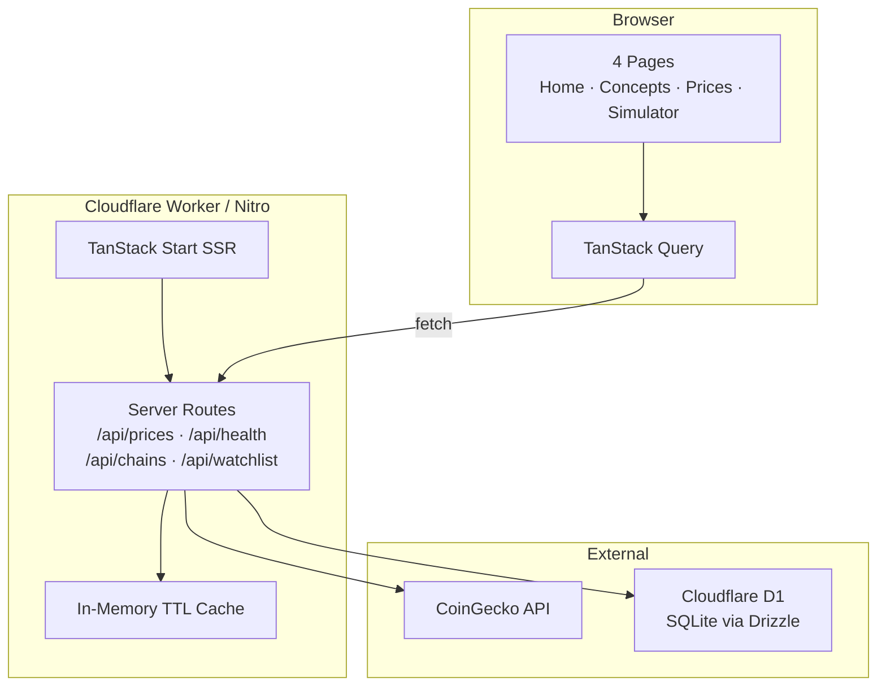

# ChainLens Academy — Full-Stack Upgrade Plan

> **Status:** Phase 0 complete · Phase 1 in progress · Phases 2–6 awaiting approval  
> **Last verified:** 2026-07-05 — `bun install`, `bun run build`, `bunx tsc --noEmit`, and all four pages return HTTP 200 on `http://localhost:8080`.

---

## Phase 0 — Baseline & Safety ✅

### What was verified

| Check | Result |
| --- | --- |
| `bun install` | ✅ 471 packages installed (Bun 1.3.14) |
| `bun run build` | ✅ Client + SSR + Nitro (Cloudflare preset) build succeeds |
| `bunx tsc --noEmit` | ✅ No type errors |
| `bun run dev` | ✅ Vite dev server on port 8080 |
| `/` | ✅ 200 |
| `/concepts` | ✅ 200 |
| `/prices` | ✅ 200 |
| `/simulator` | ✅ 200 |
| `bun run lint` | ⚠️ 89 problems (82 errors, 7 warnings) — see below |

### Pre-existing lint issues (not mass-fixed in Phase 0)

- **~80 Prettier formatting errors** across components, routes, hooks, and `api.ts`. Fixable with `bun run format` but left untouched per "don't mass-refactor" rule.
- **`useCryptoPrices.ts`:** `@typescript-eslint/no-unused-expressions` (ternary used as statement on line 27) and `no-unsafe-finally` (early `return` in `finally` block). Real logic issues — will fix in Phase 4 when migrating to TanStack Query.
- **7 `react-refresh/only-export-components` warnings** in shadcn `ui/` primitives — standard shadcn pattern, safe to ignore.
- **Build warning:** `index` chunk > 500 kB (framer-motion + recharts). Address in Phase 5 via code-splitting if needed.

### Environment note

Bun was not on PATH initially; installed via `bun.sh/install.ps1`. `skills.sh setup` will verify Bun ≥ 1.0 and guide install if missing.

---

## Phase 1 — `skills.sh` Developer Tooling 🔄

Create a POSIX `skills.sh` at repo root wrapping all common workflows:

| Command | Action |
| --- | --- |
| `setup` | Check Bun, `bun install`, copy `.env.example` → `.env` |
| `dev` | `bun run dev` |
| `build` | `bun run build` |
| `preview` | build + `bun run preview` |
| `lint` | `bun run lint` |
| `format` | `bun run format` |
| `typecheck` | `bunx tsc --noEmit` |
| `check` | lint → typecheck → build (CI gate) |
| `clean` | Remove `node_modules`, `.nitro`, `dist`, `.output` |
| `reset` | clean + setup |
| `db:migrate` | *(Phase 3)* Drizzle migrations |
| `db:seed` | *(Phase 3)* Seed default watchlist |
| `db:studio` | *(Phase 3)* Drizzle Studio |
| `test` | *(Phase 5)* Vitest unit tests |
| `help` | Auto-generated command list |

Document prominently in README.

---

## Phase 2 — Backend API Layer (TanStack Start Server Routes)

**Approach:** Add server routes inside `src/routes/api/` using `createFileRoute` + `server.handlers` — same deployable Nitro unit, no separate Express app.

### 2.1 Prices proxy — `GET /api/prices`

- Move CoinGecko fetch logic from `src/services/api.ts` to a shared server module (`src/server/coingecko.ts`).
- Add in-memory TTL cache (30s) with `Cache-Control: public, max-age=30`.
- Zod-validate outbound `Coin[]` shape.
- Update client `getCryptoPrices()` to call `/api/prices` (fulfills existing TODO).
- `useCryptoPrices` unchanged from component perspective.

### 2.2 Health route — `GET /api/health`

```json
{ "status": "ok", "uptime": 12345, "version": "1.0.0" }
```

### 2.3 Error contract

All API errors return:

```json
{ "error": { "message": "...", "code": "RATE_LIMITED" } }
```

Shared helper in `src/server/api-error.ts`.

### Files to add

```
src/routes/api/prices.ts
src/routes/api/health.ts
src/server/coingecko.ts
src/server/cache.ts
src/server/api-error.ts
src/server/schemas.ts
```

---

## Phase 3 — Persistence (Saved Chains + Watchlist)

### Database choice: **Cloudflare D1 + Drizzle ORM** ✅ Recommended

| Option | Pros | Cons | Verdict |
| --- | --- | --- | --- |
| **Cloudflare D1** | Native to deploy target (Nitro → Workers); zero cost; SQLite; wrangler bindings; no extra network hop | SQLite limits; local dev needs wrangler/miniflare | **Pick this** |
| Turso (libSQL) | Edge SQLite, good DX | External service, extra latency, another account | Good fallback |
| Neon Postgres | Full SQL, generous free tier | HTTP driver adds complexity; not native to Workers | Overkill for this scope |

**Reasoning:** The app already builds for `cloudflare-module` preset. D1 keeps everything in one Cloudflare deployment — no external DB URL to manage in production. Drizzle has first-class D1 support and excellent TypeScript. Saved chains and watchlists are simple relational data that SQLite handles easily. Local dev uses `wrangler dev` D1 bindings or a local SQLite file via Drizzle's better-sqlite3 driver.

### Schema (draft)

```sql
-- saved_chains
id          TEXT PRIMARY KEY
name        TEXT NOT NULL
blocks_json TEXT NOT NULL  -- serialized Block[]
difficulty  INTEGER
created_at  INTEGER
updated_at  INTEGER

-- watchlist
id        TEXT PRIMARY KEY  -- coin id e.g. "bitcoin"
added_at  INTEGER
```

### API routes

| Method | Path | Purpose |
| --- | --- | --- |
| `GET` | `/api/chains` | List saved chains (metadata only) |
| `POST` | `/api/chains` | Save chain `{ name, blocks, difficulty }` |
| `GET` | `/api/chains/$id` | Load full chain |
| `DELETE` | `/api/chains/$id` | Delete saved chain |
| `GET` | `/api/watchlist` | Get tracked coin IDs |
| `POST` | `/api/watchlist` | Add coin to watchlist |
| `DELETE` | `/api/watchlist/$id` | Remove coin |

### Graceful degradation

If `DB` binding is unavailable (local dev without wrangler), API routes return `503` with `{ error: { code: "DB_UNAVAILABLE" } }` and the UI shows a non-blocking banner. Client-side defaults (current `TRACKED_COIN_IDS`) remain as fallback.

### Tooling

- `drizzle.config.ts` + `src/db/schema.ts` + `src/db/index.ts`
- Migrations in `drizzle/`
- `skills.sh db:migrate`, `db:seed`, `db:studio`
- `.env.example` with `DATABASE_URL` (local) and notes for D1 binding in production

### Simulator UI changes

- "Save Chain" dialog (name input)
- Sidebar/drawer listing saved chains with load/delete actions
- Load restores blocks into `useChain` state

### Prices UI changes

- Watchlist toggle per coin (star icon)
- Prices page reads watchlist from API, falls back to defaults

---

## Phase 4 — Real-Time & Performance

1. **TanStack Query migration**
   - Replace `useCryptoPrices` manual state with `useQuery` / `useMutation`.
   - `staleTime: 30_000` (matches server cache).
   - Optimistic updates for watchlist add/remove.
   - `useMutation` for save/delete chain.

2. **SSR prefetch on Prices route**
   - `loader` in `prices.tsx` prefetches via `queryClient.prefetchQuery`.
   - `dehydrate`/`HydrationBoundary` or router context pattern.

3. **Loading states**
   - Reuse `SkeletonCard` on Prices, Concepts (if needed), Simulator save list.

4. **Debounced search** on Prices (300ms `useDeferredValue` or debounce hook).

5. **Mining loop**
   - Verify existing 500-iteration yield in `useChain.ts`.
   - Optional Web Worker for difficulty > 4 — **will ask before implementing** (trade-off: complexity vs. benefit at current difficulty defaults).

---

## Phase 5 — Polish, Correctness & Tests

| Area | Work |
| --- | --- |
| Active nav | Navbar already highlights via `pathname` — verify with TanStack Router `activeProps` for rubric compliance |
| Responsive | Audit 375 / 768 / 1280 px on all pages |
| A11y | Focus rings, `aria-label` on icons, coin `alt` text, `prefers-reduced-motion` for framer-motion |
| SEO | Verify `head()` on all 4 routes; add OG image placeholder |
| Error boundaries | Per-route error component on Prices |
| Env | All secrets via `.env`; document in `.env.example` |
| Tests | Vitest: `hash.ts`, price mapper, cache TTL; wire `skills.sh test` |

---

## Phase 6 — Docs & Submission

Full `README.md` rewrite per assignment rubric:

- Project description + four pages
- Architecture diagram (mermaid)
- `./skills.sh setup` → `./skills.sh dev` setup
- Env vars table
- Tech stack
- Known issues / future improvements
- Screenshot placeholders in `/docs/screenshots/`

---

## Architecture (target state)



---

## Commit strategy

Each phase = one or more small, working commits:

1. `chore: phase 0 baseline verification + upgrade plan`
2. `feat: add skills.sh developer tooling`
3. `feat(api): prices proxy + health endpoint` (Phase 2)
4. `feat(db): drizzle schema + migrations` (Phase 3)
5. `feat: saved chains + watchlist persistence` (Phase 3)
6. `feat: tanstack query migration + SSR prefetch` (Phase 4)
7. `chore: polish, a11y, tests` (Phase 5)
8. `docs: submission-ready README` (Phase 6)

---

## Decisions needing approval before Phase 3+

1. **D1 vs Turso** — recommend D1 (above). Confirm or override?
2. **Web Worker for mining** — only if we raise default difficulty. Skip unless you want the demo?
3. **Auth** — plan assumes anonymous/localStorage session ID for chain ownership (no login). OK for assignment scope?

---

## How to test after Phase 1

```bash
./skills.sh setup
./skills.sh dev
# Visit http://localhost:8080 — all 4 pages
./skills.sh check   # lint + typecheck + build
```
